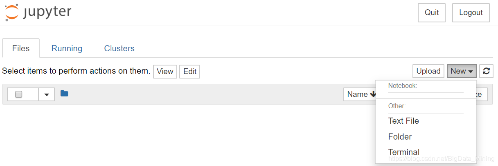
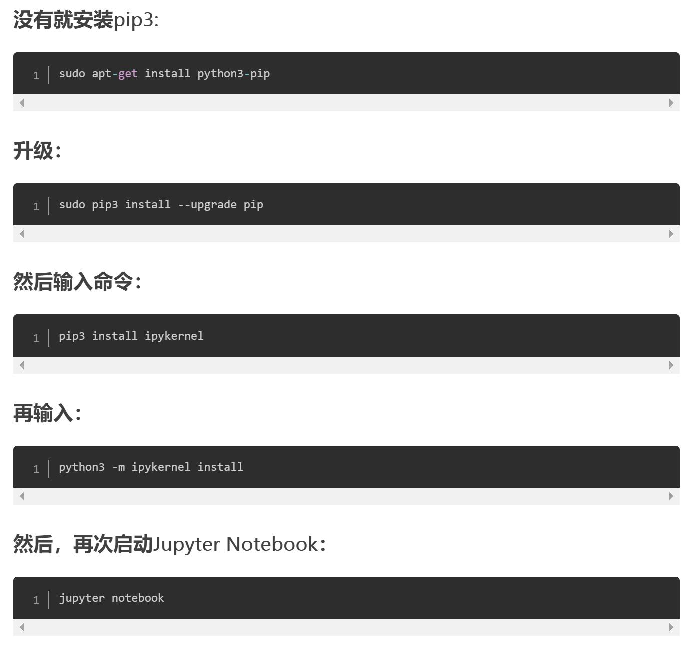
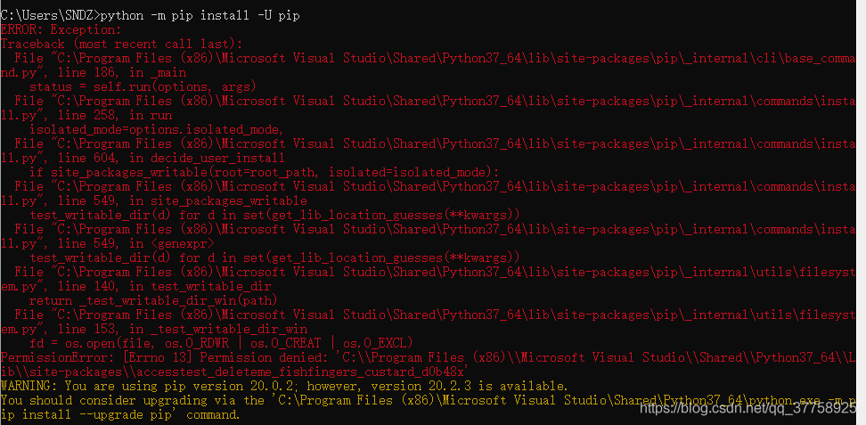
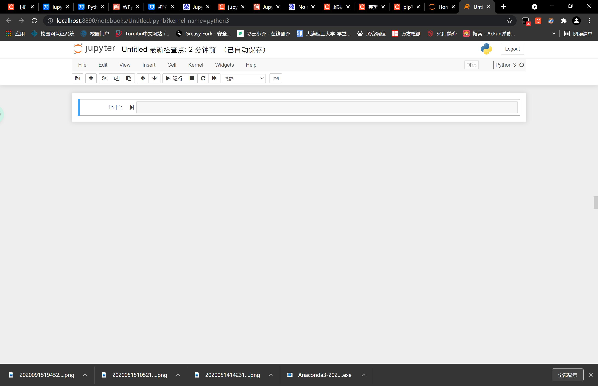

# 第一天人工智能学习心得

第六组-李沛釗

------

首先是复习了一下老师在白天讲的内容，这部分我整理在了GitHub的网页上。->[跳转](http://luopzh.github.io/Luopzh/pages/ALIai)

之后下载了Anaconda，而此时我还没意识到问题的严重性。

在安装完Anaconda后，我并未使用，而是又下载了编译器Pycharm，因为我本身在使用CLion，又有一定python的基础，因此这部分并未对我造成什么困难，跟着《python基础指南.docx》运行了些简单的语句后，我开始研究Anaconda。

而这才是噩梦的开始。

安装时确实一切正常，但当我开始使用Notebook时，我发现事情不对劲。

我的界面上并没有出现新建Python3的提示，如图：

我想起了老师给的文档中有一个知乎的常遇问题的链接，我点进去看了，但并没有我想要的答案。

于是我开始百度，也发现网上这类情况确实不少。

我选取了一个看起来靠谱的方式，通过命令台输了一大堆指令常识

*No module named ipykernel*

*You are using pip version 20.0.2*

。。。

各种各样的报错和红字炸的我脑仁疼

（因为自己没保存，就选了一张一样的报错截图）

在我又反复百度的过程里，我意识到自己因为以前学py而装的pip版本低了而产生报错。

又因为软件安装位置的问题报错。

于是我再次通过cmd更新pip的版本，而这次却又卡在了下载上

我找来镜像文件的网址

这次没问题了，成功变成最新版

在我以为万事俱备之后，紧张又期待地打开notebook之后，问题缺没有得到解决

而这个时候已经是23:45，就研究上边的错误就研究了两个多小时。

我当时十分绝望，但想着也许就差一步就可以解决了，我又开始百度。

我将看见的方法都试了一遍，却毫无成效。

就在我想直接放弃，转身上床的时候。

我看见了一篇推荐帖子，说一定要注意设置默认浏览器。

因为我虽然默认的是chorme但是每次notebook仍然自动使用IE，我本以为是个bug

所以抱着死马当活马医的心态重新更改了一下默认浏览器。

结果。。。

成功了。。。。

就这么成功了。。。。。。。。。。

这一晚上几乎什么都没干，败在了微软自带的浏览器上，这种心情十分的空虚与复杂。

草草地看了一下《Python机器学习快速上手.docx》简单地了解了一下要做什么。

实在是没时间细看了，只能堆到第二天解决了。请原谅我。

------

完成于2021-07-13 01:06 李沛钊

