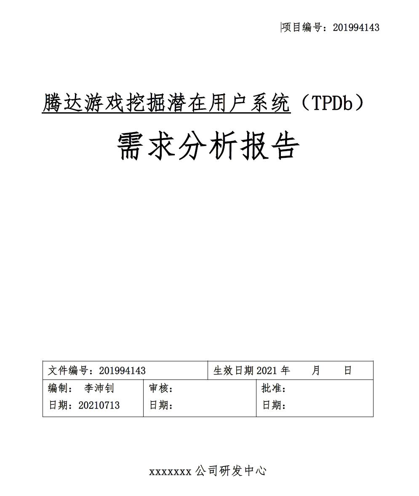
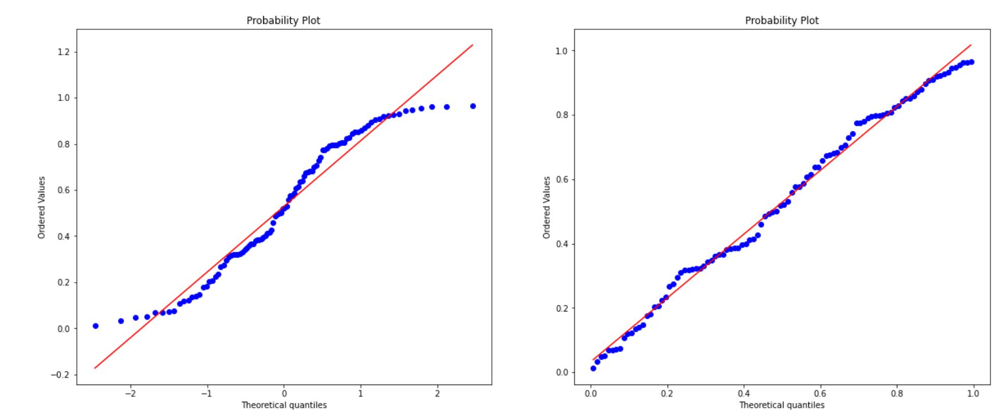
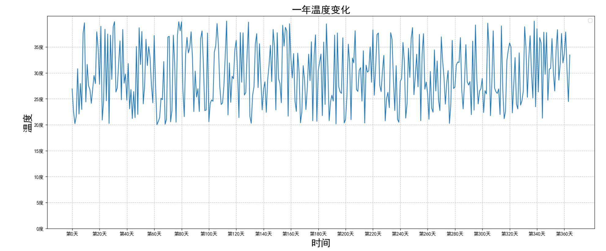
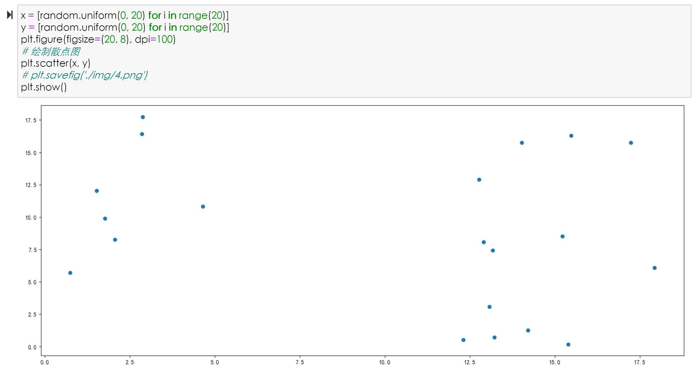
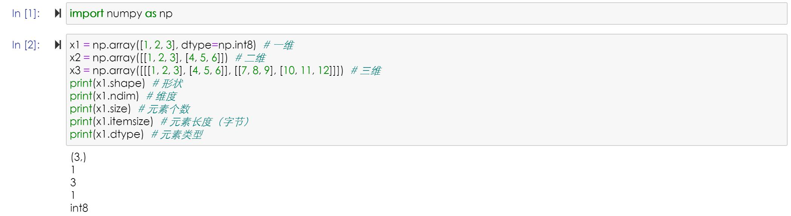
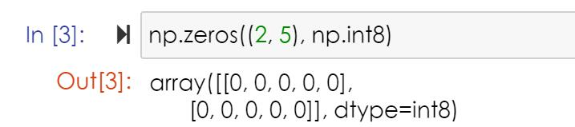

# 第二天人工智能学习心得

第六组-李沛钊

------

首先，更新了一下自己的学习笔记->[链接](https://luopzh.github.io/Luopzh/pages/ALIai) *有需求的同学可以直接看一下，如果发现有啥问题也可以直接私聊我*

之后根据白天所学内容，照猫画虎地完成了一份需求调研报告。

最后根据《Python基础》研究了一下数据分析库

### 绘图库

------

------

###  Pandas

暂时只了解了一下，并没有细看

### Numpy

------

### 选作部分

其他选作部分都了解了一下，又尝试理解了一下FM发现还是有点深奥，找个大佬讲了讲也感觉效果一般，可能还不到契机吧。

------

创作于2021-07-13 0:21 李沛钊